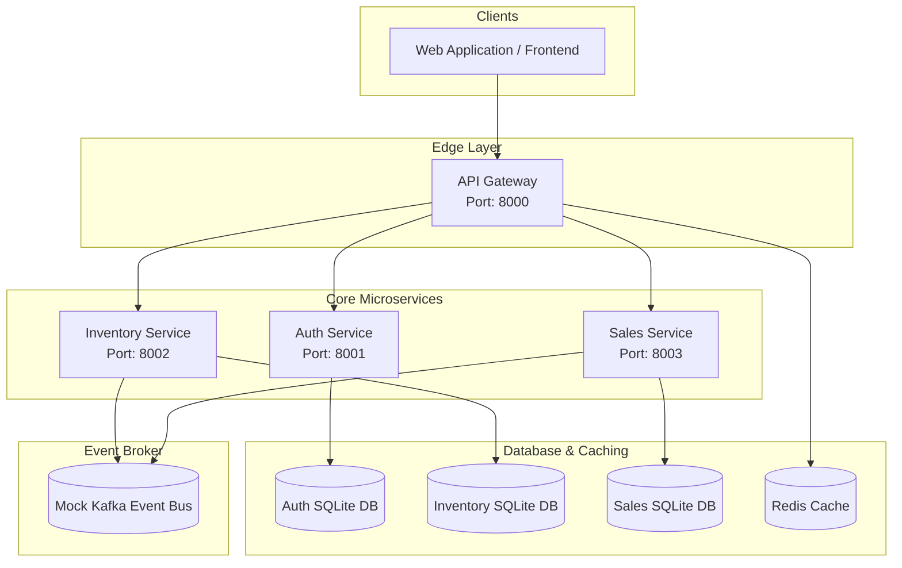

# Pharmora: Detailed Project Overview & Architectural Reference

This document provides a comprehensive, production-grade guide to the **Pharmora** platform. It details why the system was built, how it works, the technologies and concepts used, and how the various components interact.

---

## 1. Why Was Pharmora Built? (The Business Case & Necessity)

Pharmora is designed for a regional healthcare retail chain operating **180 pharmacy outlets and 12 distribution hubs across three states**. 

### The Core Challenges of Pharmacy Retail:
1. **Regulatory Compliance & Patient Safety**: Selling prescription drugs, particularly regulated or controlled substances, requires strict checks. Allowing sale of expired batches, missing/invalid doctor prescriptions, or dispensing exceeding quantity limits violates laws (e.g., FDA regulations, HIPAA, GxP) and endangers patients.
2. **Stock Discrepancy & Waste**: Pharmacies handle perishable, high-value inventory. Without real-time tracking, stores face stockouts of lifesaving medicines or waste capital on batches that expire on shelves.
3. **Inter-Branch Stock Balancing**: In a distributed retail model, one store might have a surplus of a drug while another faces an urgent shortage. Manual stock transfers are error-prone and can lead to stock duplication or loss.
4. **Checkout Latency**: High-volume outlets need near-instantaneous checkout speeds (< 200ms) even under peak loads, without sacrificing authorization or compliance checks.

### The Solution:
Pharmora solves these problems by providing a high-performance, compliant, microservices-based architecture that integrates secure identity control, real-time inventory tracking (with FEFO batch allocation), prescription-validated sales checkouts, and transactional stock conservation during transfers.

---

## 2. Platform Architecture & Service Boundaries

Pharmora follows a **Domain-Driven Design (DDD) Microservices Architecture**. Instead of a monolithic application, it splits responsibilities into independent services with their own databases to prevent tight coupling and ensure fault isolation.

### 2.1 Core Services:
* **API Gateway (`port 8000`)**: The single entry point for client traffic. It terminates SSL, terminates unauthorized requests before routing, verifies signatures on RS256 JSON Web Tokens (JWT), and checks endpoint-specific Role-Based Access Control (RBAC) rules.
* **Auth (IAM) Service (`port 8001`)**: Manages user registrations, logins, account lockouts (locking after 5 failed attempts in 15 minutes), token issuance (RS256 JWTs), token refresh rotation, and logout token revocation.
* **Inventory Service (`port 8002`)**: Tracks products, stock levels, reorder thresholds, and active batches. It implements FEFO (First Expiry, First Out) query lookups, handles receipts/adjustments, and controls inter-branch stock transfers.
* **Sales Service (`port 8003`)**: Manages transactions. It validates medical prescriptions, verifies stock locks, updates batch counts upon sale, processes payments, and rolls back transaction-level changes if checkout fails.

---

## 3. Technology Stack & Why We Used Them

| Technology | Role | Necessity / Choice Rationale |
| :--- | :--- | :--- |
| **Python 3.12** | Core programming language | Offers excellent developer velocity, strong typing capabilities with Pydantic, and native support for rich web frameworks and AI/ML libraries. |
| **FastAPI** | Web framework | High performance (ASGI-based), automatic interactive OpenAPI docs, native type-safe dependency injection, and async request handling. |
| **SQLAlchemy 2.0 (Async)** | Database ORM | Provides modern async database operations (`AsyncSession`), prevents blocking database calls in FastAPI event loops, and manages complex relational database logic. |
| **Pydantic v2** | Data validation & serialization | Fastest data parsing in Python, ensures request body validation, and manages config schemas cleanly. |
| **SQLite (aiosqlite)** | Local database engine | Zero-configuration database for local development and testing, allowing fast, parallelizable, asynchronous unit tests. Easily maps to PostgreSQL in production. |
| **PostgreSQL (asyncpg / psycopg2-binary)** | Production Database | High-performance, concurrent production database. The system automatically converts standard database URL schemes to `postgresql+asyncpg://` and supports `sslmode=require` query parameters for secure cloud connections. |
| **Apache Kafka (Mocked)** | Message Broker | Decouples services asynchronously. For example, when a sale completes, the Sales service publishes an event to Kafka, and the Inventory service consumes it to deduct stock, avoiding direct HTTP coupling. |
| **RS256 JWT** | Security mechanism | Cryptographically signed tokens (private key signature, public key verification) allow the API Gateway to verify credentials offline without querying the Auth database on every request. |
| **Pytest & Hypothesis** | Testing frameworks | Combines standard unit/integration testing with property-based testing (fuzzing APIs with randomized inputs to detect edge-case failures). |
| **Render & Vercel** | Hosting Platforms | Backend microservices and the API Gateway are deployed on Render (configured with auto-migration and `start.sh` entrypoint), and the React frontend is deployed on Vercel. |

---

## 4. Key Concepts & How They Work

### 4.1 Role-Based Access Control (RBAC) & Scoping
Pharmora enforces RBAC with four primary roles:
1. **Regional Admin**: Can create and manage users, deactivate accounts, and oversee regions.
2. **Pharmacist**: Authorized to create invoices, validate prescriptions, and complete checkouts.
3. **Inventory Controller**: Authorized to record stock receipts, perform stock adjustments, and handle stock transfers.
4. **Finance Manager**: Authorized to view financial reports, sales margins, and transaction volumes.

* **Outlet Scoping**: Users (except Regional Admins) are bound to a specific outlet. A Pharmacist at Store A cannot view or check out sales for Store B. The API Gateway automatically extracts the user's `outlet_scope` from the JWT and injects it into headers (`X-Outlet-Scope`), which downstream services use to filter database queries.

### 4.2 Stock Conservation Invariant (Property 24 & 25)
During a stock transfer from a **Source Outlet** to a **Destination Outlet**, stock must never disappear or double-allocate:
1. **DRAFT / APPROVED**: The transfer order is created. The required quantity is **reserved** at the Source (transferred from `total_quantity - reserved_quantity` to `reserved_quantity`).
2. **CANCELLED**: If the transfer is cancelled, the reserved quantity is returned to the active stock pools at the Source (restoring `reserved_quantity = 0`).
3. **DISPATCHED**: Stock is in transit.
4. **RECEIVED**: The destination outlet receives the stock. The quantities are physically deducted from the Source (both `total_quantity` and `reserved_quantity` decremented) and added to the Destination's `total_quantity`.

### 4.3 FEFO (First Expiry, First Out) Batch Handling
To prevent dispensing expired medications:
- Whenever a sale or stock transfer occurs, the system queries active batches matching the product ID and outlet ID.
- Batches are sorted in ascending order of their expiry date (`expiry_date ASC`).
- Quantities are deducted from the earliest-expiring batch first.
- If a batch's quantity reaches 0, its status is set to `EXHAUSTED`.
- In a transfer, if matching batches are not pre-existing at the destination, a corresponding batch record is created to preserve tracking details. If source batches are missing or insufficient, a fallback batch named `TRF-XXXXXX` is automatically generated.

### 4.4 Transactional Checkout Safety & Rollbacks
If a pharmacist attempts a checkout:
1. **Prescription Validation**: Checks that the prescription is not expired, links matching products, checks quantity caps, and confirms it hasn't already been fully dispensed.
2. **Stock Verification**: Checks that enough unreserved stock exists in active batches.
3. **Database Write**: Deducts stock and logs invoice.
4. **Kafka Notification**: Emits sales events.
- **Rollback Guarantee**: If any step fails (e.g., card payment fails or gateway disconnects), the transaction is completely rolled back, releasing any temporary stock locks.

### 4.5 Clinical Overrides & Safety Clearances
To balance safety and regulatory requirements with real-world clinical urgency:
- If a prescription check flags a warning (e.g., potential drug interaction or dosage threshold), the system does not silently fail or hard-block checkouts in emergency cases.
- Instead, the pharmacist can register a **Clinical Override** with detailed clinical justification.
- Overrides are logged in the `clinical_overrides` audit table, linking the pharmacist's ID, prescription ID, and timestamp, satisfying compliance requirements while keeping checkouts fluid.

### 4.6 Conversational BI Assistant & Row-Level Security
The Finance Manager dashboard features a Conversational BI Assistant that allows querying store performance using natural language:
- The system translates natural language queries into SQL database queries.
- To prevent data leaks across regional boundaries, the API Gateway/Reporting layer enforces **Row-Level Security (RLS)** by parsing the user's regional and outlet scopes from their JWT and appending strict `WHERE` constraints to any dynamically generated SQL query before execution.
- SQL execution logs and raw data tables are rendered transparently for auditing.

### 4.7 Dynamic RSA Key Sync & Clock Drift Protection
In development and deployment environments:
- The Auth Service dynamically generates a secure RSA keypair (`jwt_private.pem` and `jwt_public.pem`) in the root workspace if not already present.
- All microservices read these shared key files to verify RS256 signatures offline.
- To prevent local system timezone issues or slight clock drifts across container hosts from invalidating active sessions, PyJWT is configured with clock-skew tolerance (`verify_exp` parameters are adjusted or offset during verification).

---

## 5. Summary of Verification & Test Suites

The project features a rigorous test suite consisting of **34 unit and integration tests** verifying all business invariants.

### Test Categories:
1. **Auth Service (`test_auth_service.py`)**: Tests login, token rotation, deactivation blocklisting, and account lockout after 5 consecutive failures.
2. **API Gateway (`test_api_gateway.py`)**: Tests JWT validation, scope checking, header injection, and RBAC rejection (e.g., verifying a Pharmacist cannot access admin routes).
3. **Inventory Service (`test_inventory_service.py`)**: Tests receipt creation, adjustments, reorder point alerts, stock transfers, FEFO batch sorting, and the **Stock Conservation Invariant**.
4. **Sales Service (`test_sales_service.py`)**: Tests invoice creation, prescription validation, regulated drug restrictions, expired batch rejection, and failed transaction rollback.
5. **Shared Utilities (`test_shared_utilities.py`)**: Tests core event serialization and Kafka producer/consumer mock functionality.

All 34 tests execute asynchronously and pass without errors.

---

## 6. Production Deployment Configuration

Pharmora is configured for continuous deployment using Git-push integrations:
1. **Frontend (Vercel)**: Deployed at `https://pharmorago.vercel.app/`. The React app builds from the `frontend/` subdirectory and communicates with the centralized API Gateway.
2. **Backend (Render)**: All 4 microservices (Auth, Inventory, Sales, Gateway) are hosted on Render.
   - **Unified Entrypoint (`start.sh`)**: A custom startup script handles service routing, runs database migrations automatically for the Auth service, and starts the Uvicorn servers.
   - **Database Compatibility**: The shared database module automatically rewrites incoming database URLs to use the async-compatible `postgresql+asyncpg://` protocol and injects secure SSL connection parameters (`sslmode=require`) to support cloud-hosted PostgreSQL instances.
