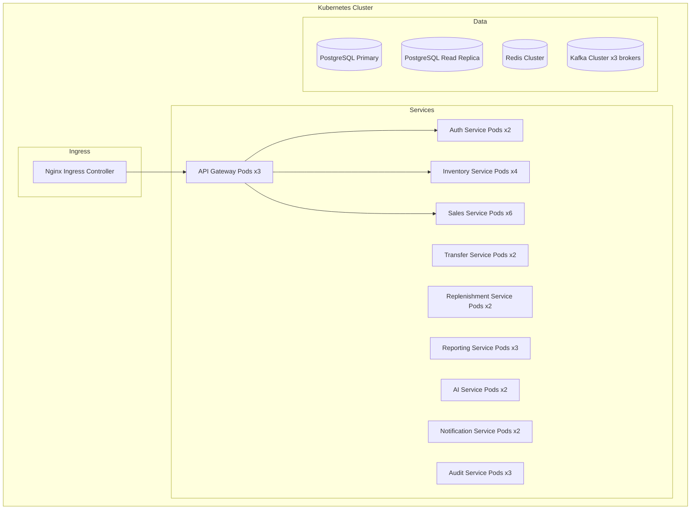
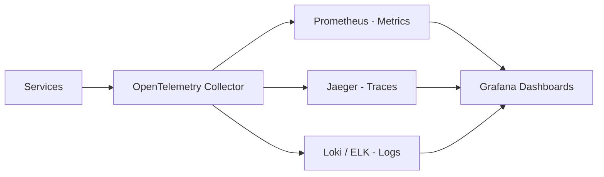
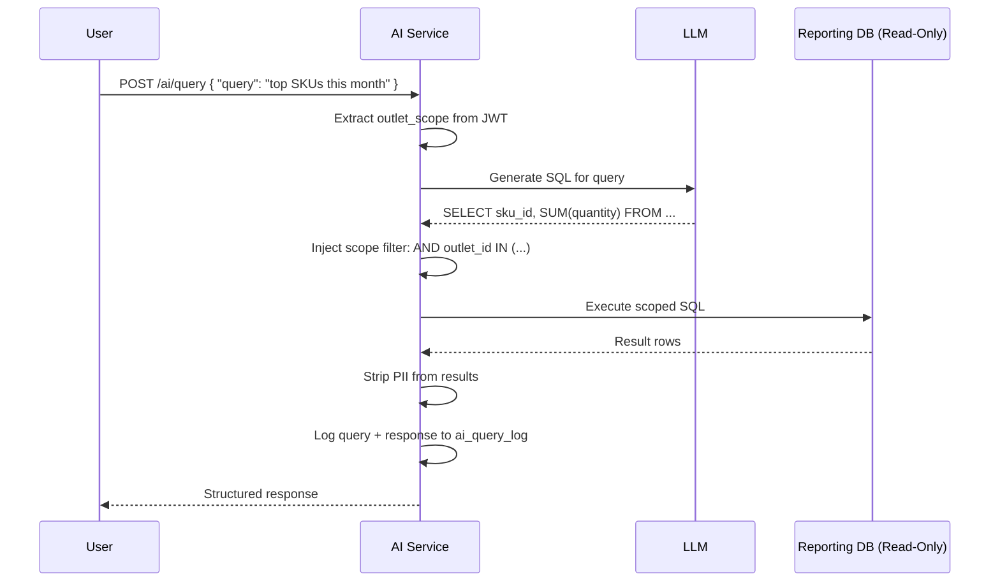

# Design Document: Pharmora

## Overview

Pharmora is a production-grade, microservices-based healthcare retail platform serving 180 pharmacy outlets and 12 distribution hubs across three states. The system is built on a Python stack with PostgreSQL as the primary database, deployed in Docker containers orchestrated by Kubernetes, and designed for horizontal scalability, high availability, and regulatory compliance.

The platform covers secure multi-role authentication, real-time inventory management, prescription-linked sales, batch/expiry tracking, inter-branch transfers, replenishment planning, BI reporting, and agentic AI capabilities including anomaly detection, replenishment recommendations, and conversational querying.

---

## Architecture

### Architectural Style

The system follows a **domain-driven microservices architecture** with:
- Synchronous REST/HTTP for client-facing and latency-sensitive operations
- Asynchronous event-driven messaging (Apache Kafka) for inter-service integration and eventual consistency
- An API Gateway as the single entry point for all external traffic
- A shared observability stack (OpenTelemetry + Prometheus + ELK)

### High-Level Architecture Diagram

```mermaid
graph TB
    subgraph Clients
        WebApp[Web Application]
        MobileApp[Mobile App]
    end

    subgraph Edge
        APIGW[API Gateway<br/>FastAPI + Auth Middleware]
    end

    subgraph Core Services
        AuthSvc[Auth Service<br/>FastAPI + JWT]
        InventorySvc[Inventory Service<br/>FastAPI]
        SalesSvc[Sales Service<br/>FastAPI]
        TransferSvc[Transfer Service<br/>FastAPI]
        ReplenishSvc[Replenishment Service<br/>FastAPI]
        ReportingSvc[Reporting Service<br/>FastAPI]
        AISvc[AI Service<br/>FastAPI + LangChain]
        NotifSvc[Notification Service<br/>FastAPI + Celery]
        AuditSvc[Audit Service<br/>FastAPI - Append Only]
    end

    subgraph Data Layer
        AuthDB[(Auth DB<br/>PostgreSQL)]
        InventoryDB[(Inventory DB<br/>PostgreSQL)]
        SalesDB[(Sales DB<br/>PostgreSQL)]
        TransferDB[(Transfer DB<br/>PostgreSQL)]
        ReplenishDB[(Replenishment DB<br/>PostgreSQL)]
        ReportingDB[(Reporting DB<br/>PostgreSQL - Read Replica)]
        AIDB[(AI DB<br/>PostgreSQL + pgvector)]
        AuditDB[(Audit DB<br/>PostgreSQL - Append Only)]
        Redis[(Redis<br/>Cache + Sessions)]
    end

    subgraph Messaging
        Kafka[Apache Kafka<br/>Event Bus]
    end

    subgraph Observability
        OTel[OpenTelemetry Collector]
        Prometheus[Prometheus]
        ELK[ELK Stack]
        Grafana[Grafana]
    end

    WebApp --> APIGW
    MobileApp --> APIGW
    APIGW --> AuthSvc
    APIGW --> InventorySvc
    APIGW --> SalesSvc
    APIGW --> TransferSvc
    APIGW --> ReplenishSvc
    APIGW --> ReportingSvc
    APIGW --> AISvc
    APIGW --> NotifSvc

    AuthSvc --> AuthDB
    InventorySvc --> InventoryDB
    SalesSvc --> SalesDB
    TransferSvc --> TransferDB
    ReplenishSvc --> ReplenishDB
    ReportingSvc --> ReportingDB
    AISvc --> AIDB
    AuditSvc --> AuditDB

    SalesSvc --> Kafka
    InventorySvc --> Kafka
    TransferSvc --> Kafka
    ReplenishSvc --> Kafka
    AISvc --> Kafka
    Kafka --> NotifSvc
    Kafka --> AuditSvc
    Kafka --> ReportingSvc
    Kafka --> AISvc

    APIGW --> Redis
    AuthSvc --> Redis
    InventorySvc --> Redis

    Core Services --> OTel
    OTel --> Prometheus
    OTel --> ELK
    Prometheus --> Grafana
```

### Service Decomposition Rationale

| Service | Domain Boundary | Scaling Driver |
|---|---|---|
| Auth Service | Identity and access | Low volume, stateless |
| Inventory Service | Stock levels, batches, expiry | High write throughput (sales) |
| Sales Service | POS, invoicing, prescriptions | Highest throughput, latency-critical |
| Transfer Service | Inter-branch logistics | Moderate, workflow-driven |
| Replenishment Service | Demand planning, PO generation | Batch + event-driven |
| Reporting Service | BI queries, dashboards | Read-heavy, separate read replica |
| AI Service | ML inference, NLP querying | GPU/CPU intensive, separate scaling |
| Notification Service | Alert delivery | Async, queue-backed |
| Audit Service | Compliance logging | High write, append-only |
| API Gateway | Routing, auth, rate limiting | Scales with total traffic |

---

## Components and Interfaces

### API Gateway

- Built with FastAPI + custom middleware
- Responsibilities: JWT validation, RBAC enforcement, rate limiting, request routing, TLS termination, distributed trace injection
- Rate limits: 1000 req/min per outlet, 100 req/min per user
- Forwards `X-User-ID`, `X-User-Role`, `X-Outlet-Scope`, `X-Trace-ID` headers to downstream services

### Auth Service

**Endpoints:**
```
POST /auth/login              → { access_token, refresh_token, expires_in }
POST /auth/refresh            → { access_token, refresh_token }
POST /auth/logout             → 204 No Content
POST /auth/users              → Create user (Regional_Admin only)
PATCH /auth/users/{id}        → Update user / assign role
DELETE /auth/users/{id}       → Deactivate user
GET  /auth/users/{id}         → Get user profile
```

**JWT Claims Structure:**
```json
{
  "sub": "user_uuid",
  "role": "pharmacist",
  "outlet_scope": ["outlet_001", "outlet_002"],
  "region": "region_south",
  "iat": 1700000000,
  "exp": 1700003600
}
```

### Inventory Service

**Endpoints:**
```
GET  /inventory/{outlet_id}/stock              → Current stock levels
GET  /inventory/{outlet_id}/stock/{sku_id}     → Stock for specific SKU
GET  /inventory/{outlet_id}/batches/{sku_id}   → Batches sorted by expiry (FEFO)
POST /inventory/{outlet_id}/receipts           → Record stock receipt
POST /inventory/{outlet_id}/adjustments        → Manual stock adjustment
GET  /inventory/{outlet_id}/low-stock          → SKUs below reorder point
GET  /inventory/{outlet_id}/expiry-alerts      → Batches expiring within N days
```

**Stock Update Event (Kafka topic: `inventory.stock.updated`):**
```json
{
  "event_type": "STOCK_DECREMENTED",
  "outlet_id": "outlet_001",
  "sku_id": "sku_abc",
  "batch_id": "batch_xyz",
  "quantity_delta": -2,
  "new_quantity": 48,
  "reason": "SALE",
  "reference_id": "invoice_001",
  "timestamp": "2024-01-15T10:30:00Z"
}
```

### Sales Service

**Endpoints:**
```
POST /sales/transactions                       → Create transaction (checkout)
GET  /sales/transactions/{id}                  → Get transaction details
POST /sales/transactions/{id}/void             → Void invoice
GET  /sales/invoices/{invoice_number}          → Get invoice
POST /sales/prescriptions                      → Register prescription
GET  /sales/prescriptions/{ref}                → Get prescription + dispensing history
POST /sales/prescriptions/{ref}/dispense       → Dispense against prescription
```

**Transaction Request:**
```json
{
  "outlet_id": "outlet_001",
  "pharmacist_id": "user_uuid",
  "payment_method": "CARD",
  "line_items": [
    {
      "sku_id": "sku_abc",
      "batch_id": "batch_xyz",
      "quantity": 2,
      "prescription_ref": "rx_001"
    }
  ]
}
```

### Transfer Service

**Endpoints:**
```
POST /transfers                                → Create transfer order
GET  /transfers/{id}                           → Get transfer order
PATCH /transfers/{id}/approve                  → Approve transfer
PATCH /transfers/{id}/dispatch                 → Mark as dispatched
PATCH /transfers/{id}/receive                  → Mark as received
PATCH /transfers/{id}/cancel                   → Cancel transfer
GET  /transfers?outlet_id=&status=&from=&to=   → List transfers
```

### Replenishment Service

**Endpoints:**
```
GET  /replenishment/recommendations            → List pending recommendations
POST /replenishment/recommendations/{id}/approve  → Approve recommendation
POST /replenishment/recommendations/{id}/reject   → Reject recommendation
POST /replenishment/recommendations/{id}/modify   → Modify and approve
GET  /replenishment/purchase-orders            → List generated POs
```

### Reporting Service

**Endpoints:**
```
GET  /reports/sales-summary?outlet_id=&from=&to=&category=
GET  /reports/gross-margin?outlet_id=&from=&to=&sku_id=
GET  /reports/demand-trends?outlet_id=&sku_id=&window=30
GET  /reports/dashboard/realtime?outlet_id=
POST /reports/export?format=csv|pdf
```

### AI Service

**Endpoints:**
```
POST /ai/query                                 → Conversational NL query
GET  /ai/anomalies                             → List flagged anomalies
POST /ai/anomalies/{id}/resolve                → Resolve anomaly alert
POST /ai/anomalies/{id}/false-positive         → Mark as false positive
GET  /ai/replenishment-recommendations         → AI-generated recommendations
```

**Conversational Query Request:**
```json
{
  "query": "What are the top 5 selling SKUs in outlet_001 this month?",
  "user_id": "user_uuid",
  "outlet_scope": ["outlet_001"]
}
```

---

## Data Models

### Auth Service Schema

```sql
-- Users
CREATE TABLE users (
    id UUID PRIMARY KEY DEFAULT gen_random_uuid(),
    username VARCHAR(100) UNIQUE NOT NULL,
    email VARCHAR(255) UNIQUE NOT NULL,
    password_hash VARCHAR(255) NOT NULL,
    role VARCHAR(50) NOT NULL CHECK (role IN ('regional_admin','pharmacist','inventory_controller','finance_manager')),
    region_id UUID REFERENCES regions(id),
    is_active BOOLEAN DEFAULT TRUE,
    failed_login_attempts INTEGER DEFAULT 0,
    locked_until TIMESTAMPTZ,
    created_at TIMESTAMPTZ DEFAULT NOW(),
    updated_at TIMESTAMPTZ DEFAULT NOW()
);

-- Outlet scope assignments
CREATE TABLE user_outlet_scope (
    user_id UUID REFERENCES users(id),
    outlet_id UUID NOT NULL,
    PRIMARY KEY (user_id, outlet_id)
);

-- Refresh tokens
CREATE TABLE refresh_tokens (
    id UUID PRIMARY KEY DEFAULT gen_random_uuid(),
    user_id UUID REFERENCES users(id),
    token_hash VARCHAR(255) UNIQUE NOT NULL,
    issued_at TIMESTAMPTZ DEFAULT NOW(),
    expires_at TIMESTAMPTZ NOT NULL,
    revoked BOOLEAN DEFAULT FALSE
);

-- Regions
CREATE TABLE regions (
    id UUID PRIMARY KEY DEFAULT gen_random_uuid(),
    name VARCHAR(100) NOT NULL,
    state VARCHAR(50) NOT NULL
);
```

### Inventory Service Schema

```sql
-- Products / SKUs
CREATE TABLE products (
    id UUID PRIMARY KEY DEFAULT gen_random_uuid(),
    sku_code VARCHAR(50) UNIQUE NOT NULL,
    name VARCHAR(255) NOT NULL,
    category VARCHAR(100) NOT NULL,
    schedule_class VARCHAR(10),  -- NULL, 'H', 'X' for regulated drugs
    unit_of_measure VARCHAR(20) NOT NULL,
    reorder_point INTEGER NOT NULL DEFAULT 0,
    lead_time_days INTEGER NOT NULL DEFAULT 7,
    created_at TIMESTAMPTZ DEFAULT NOW()
);

-- Stock levels per outlet/hub
CREATE TABLE stock_levels (
    id UUID PRIMARY KEY DEFAULT gen_random_uuid(),
    outlet_id UUID NOT NULL,
    product_id UUID REFERENCES products(id),
    total_quantity INTEGER NOT NULL DEFAULT 0 CHECK (total_quantity >= 0),
    reserved_quantity INTEGER NOT NULL DEFAULT 0 CHECK (reserved_quantity >= 0),
    updated_at TIMESTAMPTZ DEFAULT NOW(),
    UNIQUE (outlet_id, product_id)
);

-- Batch tracking
CREATE TABLE batches (
    id UUID PRIMARY KEY DEFAULT gen_random_uuid(),
    product_id UUID REFERENCES products(id),
    outlet_id UUID NOT NULL,
    batch_number VARCHAR(100) NOT NULL,
    manufacture_date DATE NOT NULL,
    expiry_date DATE NOT NULL,
    quantity INTEGER NOT NULL DEFAULT 0 CHECK (quantity >= 0),
    status VARCHAR(20) DEFAULT 'ACTIVE' CHECK (status IN ('ACTIVE','EXHAUSTED','RECALLED')),
    created_at TIMESTAMPTZ DEFAULT NOW(),
    UNIQUE (product_id, outlet_id, batch_number)
);
CREATE INDEX idx_batches_expiry ON batches(outlet_id, product_id, expiry_date) WHERE status = 'ACTIVE';

-- Stock adjustments
CREATE TABLE stock_adjustments (
    id UUID PRIMARY KEY DEFAULT gen_random_uuid(),
    outlet_id UUID NOT NULL,
    product_id UUID REFERENCES products(id),
    batch_id UUID REFERENCES batches(id),
    quantity_delta INTEGER NOT NULL,
    reason VARCHAR(100) NOT NULL,
    reference_id UUID,
    performed_by UUID NOT NULL,
    created_at TIMESTAMPTZ DEFAULT NOW()
);
```

### Sales Service Schema

```sql
-- Transactions
CREATE TABLE transactions (
    id UUID PRIMARY KEY DEFAULT gen_random_uuid(),
    invoice_number VARCHAR(50) UNIQUE NOT NULL,
    outlet_id UUID NOT NULL,
    pharmacist_id UUID NOT NULL,
    status VARCHAR(20) DEFAULT 'COMPLETED' CHECK (status IN ('PENDING','COMPLETED','VOIDED')),
    payment_method VARCHAR(20) NOT NULL CHECK (payment_method IN ('CASH','CARD','UPI')),
    subtotal NUMERIC(12,2) NOT NULL,
    tax_amount NUMERIC(12,2) NOT NULL DEFAULT 0,
    discount_amount NUMERIC(12,2) NOT NULL DEFAULT 0,
    total_amount NUMERIC(12,2) NOT NULL,
    voided_at TIMESTAMPTZ,
    voided_by UUID,
    created_at TIMESTAMPTZ DEFAULT NOW()
);

-- Transaction line items
CREATE TABLE transaction_line_items (
    id UUID PRIMARY KEY DEFAULT gen_random_uuid(),
    transaction_id UUID REFERENCES transactions(id),
    product_id UUID NOT NULL,
    batch_id UUID NOT NULL,
    quantity INTEGER NOT NULL CHECK (quantity > 0),
    unit_price NUMERIC(10,2) NOT NULL,
    tax_rate NUMERIC(5,4) NOT NULL DEFAULT 0,
    discount_rate NUMERIC(5,4) NOT NULL DEFAULT 0,
    line_total NUMERIC(12,2) NOT NULL,
    prescription_id UUID REFERENCES prescriptions(id)
);

-- Prescriptions
CREATE TABLE prescriptions (
    id UUID PRIMARY KEY DEFAULT gen_random_uuid(),
    prescription_ref VARCHAR(100) UNIQUE NOT NULL,
    patient_id_encrypted TEXT NOT NULL,  -- AES-256 encrypted
    doctor_name VARCHAR(255) NOT NULL,
    doctor_registration VARCHAR(100) NOT NULL,
    prescription_date DATE NOT NULL,
    status VARCHAR(20) DEFAULT 'OPEN' CHECK (status IN ('OPEN','PARTIAL','CLOSED')),
    created_at TIMESTAMPTZ DEFAULT NOW()
);

-- Prescription line items
CREATE TABLE prescription_items (
    id UUID PRIMARY KEY DEFAULT gen_random_uuid(),
    prescription_id UUID REFERENCES prescriptions(id),
    product_id UUID NOT NULL,
    prescribed_quantity INTEGER NOT NULL,
    dispensed_quantity INTEGER NOT NULL DEFAULT 0,
    remaining_quantity INTEGER GENERATED ALWAYS AS (prescribed_quantity - dispensed_quantity) STORED
);
```

### Transfer Service Schema

```sql
CREATE TABLE transfer_orders (
    id UUID PRIMARY KEY DEFAULT gen_random_uuid(),
    transfer_number VARCHAR(50) UNIQUE NOT NULL,
    source_outlet_id UUID NOT NULL,
    destination_outlet_id UUID NOT NULL,
    status VARCHAR(20) DEFAULT 'DRAFT' CHECK (status IN ('DRAFT','APPROVED','DISPATCHED','RECEIVED','CANCELLED')),
    initiated_by UUID NOT NULL,
    approved_by UUID,
    dispatched_at TIMESTAMPTZ,
    received_at TIMESTAMPTZ,
    created_at TIMESTAMPTZ DEFAULT NOW(),
    updated_at TIMESTAMPTZ DEFAULT NOW()
);

CREATE TABLE transfer_line_items (
    id UUID PRIMARY KEY DEFAULT gen_random_uuid(),
    transfer_order_id UUID REFERENCES transfer_orders(id),
    product_id UUID NOT NULL,
    batch_id UUID NOT NULL,
    requested_quantity INTEGER NOT NULL CHECK (requested_quantity > 0),
    dispatched_quantity INTEGER,
    received_quantity INTEGER
);
```

### Replenishment Service Schema

```sql
CREATE TABLE replenishment_recommendations (
    id UUID PRIMARY KEY DEFAULT gen_random_uuid(),
    outlet_id UUID NOT NULL,
    product_id UUID NOT NULL,
    recommended_quantity INTEGER NOT NULL,
    current_stock INTEGER NOT NULL,
    avg_daily_consumption NUMERIC(10,2) NOT NULL,
    days_of_stock_remaining NUMERIC(10,2) NOT NULL,
    urgency VARCHAR(20) CHECK (urgency IN ('LOW','MEDIUM','HIGH','CRITICAL')),
    source VARCHAR(20) CHECK (source IN ('RULE_BASED','AI_GENERATED')),
    ai_confidence_score NUMERIC(5,4),
    status VARCHAR(20) DEFAULT 'PENDING' CHECK (status IN ('PENDING','APPROVED','REJECTED','MODIFIED')),
    reviewed_by UUID,
    reviewed_at TIMESTAMPTZ,
    created_at TIMESTAMPTZ DEFAULT NOW()
);

CREATE TABLE purchase_orders (
    id UUID PRIMARY KEY DEFAULT gen_random_uuid(),
    po_number VARCHAR(50) UNIQUE NOT NULL,
    outlet_id UUID NOT NULL,
    hub_id UUID NOT NULL,
    status VARCHAR(20) DEFAULT 'RAISED' CHECK (status IN ('RAISED','CONFIRMED','DISPATCHED','RECEIVED')),
    total_value NUMERIC(14,2),
    created_at TIMESTAMPTZ DEFAULT NOW()
);

CREATE TABLE purchase_order_items (
    id UUID PRIMARY KEY DEFAULT gen_random_uuid(),
    po_id UUID REFERENCES purchase_orders(id),
    product_id UUID NOT NULL,
    quantity INTEGER NOT NULL,
    unit_cost NUMERIC(10,2),
    recommendation_id UUID REFERENCES replenishment_recommendations(id)
);
```

### Audit Service Schema

```sql
CREATE TABLE audit_events (
    id UUID PRIMARY KEY DEFAULT gen_random_uuid(),
    trace_id VARCHAR(64) NOT NULL,
    service_name VARCHAR(100) NOT NULL,
    event_type VARCHAR(100) NOT NULL,
    entity_type VARCHAR(100) NOT NULL,
    entity_id UUID NOT NULL,
    user_id UUID NOT NULL,
    outlet_id UUID,
    before_state JSONB,
    after_state JSONB,
    metadata JSONB,
    created_at TIMESTAMPTZ DEFAULT NOW()
    -- No UPDATE or DELETE permissions granted on this table
);
CREATE INDEX idx_audit_entity ON audit_events(entity_type, entity_id);
CREATE INDEX idx_audit_user ON audit_events(user_id, created_at DESC);
CREATE INDEX idx_audit_created ON audit_events(created_at DESC);
```

### AI Service Schema

```sql
CREATE TABLE anomaly_alerts (
    id UUID PRIMARY KEY DEFAULT gen_random_uuid(),
    alert_type VARCHAR(50) NOT NULL CHECK (alert_type IN ('SUSPICIOUS_TRANSACTION','STOCK_VARIANCE')),
    entity_id UUID NOT NULL,
    outlet_id UUID NOT NULL,
    confidence_score NUMERIC(5,4) NOT NULL,
    deviation_details JSONB NOT NULL,
    status VARCHAR(20) DEFAULT 'OPEN' CHECK (status IN ('OPEN','RESOLVED','FALSE_POSITIVE')),
    resolved_by UUID,
    resolved_at TIMESTAMPTZ,
    created_at TIMESTAMPTZ DEFAULT NOW()
);

CREATE TABLE ai_query_log (
    id UUID PRIMARY KEY DEFAULT gen_random_uuid(),
    user_id UUID NOT NULL,
    query_text TEXT NOT NULL,
    response_text TEXT,
    outlet_scope JSONB NOT NULL,
    response_time_ms INTEGER,
    created_at TIMESTAMPTZ DEFAULT NOW()
);

-- pgvector for semantic search on product catalog
CREATE EXTENSION IF NOT EXISTS vector;
CREATE TABLE product_embeddings (
    product_id UUID PRIMARY KEY,
    embedding vector(1536),
    updated_at TIMESTAMPTZ DEFAULT NOW()
);
```

---

## Correctness Properties

*A property is a characteristic or behavior that should hold true across all valid executions of a system — essentially, a formal statement about what the system should do. Properties serve as the bridge between human-readable specifications and machine-verifiable correctness guarantees.*

### Property 1: JWT Issuance Correctness
*For any* valid username/password pair, the Auth_Service response must contain a structurally valid JWT access token (three base64url segments, valid signature, non-expired `exp` claim) and a non-empty refresh token string.
**Validates: Requirements 1.1**

### Property 2: Failed Login Counter Monotonicity
*For any* sequence of N invalid login attempts on the same account, the failed_login_attempts counter must equal N after those attempts, and must not decrease between attempts.
**Validates: Requirements 1.2**

### Property 3: Refresh Token Rotation
*For any* valid refresh token, using it once must succeed and produce a new refresh token; using the same original refresh token a second time must fail with a 401 response.
**Validates: Requirements 1.5**

### Property 4: Logout Invalidates Refresh Token
*For any* active session, after a logout call, any subsequent use of the session's refresh token must return a 401 response.
**Validates: Requirements 1.6**

### Property 5: JWT Gateway Validation
*For any* request to a protected endpoint, the API_Gateway must forward the request if and only if the JWT is structurally valid, has a valid signature, and has a non-expired `exp` claim; all other requests must receive a 401 response.
**Validates: Requirements 1.8**

### Property 6: RBAC Enforcement
*For any* combination of user role and API endpoint, the API_Gateway must permit the request if and only if the role's permission set includes that endpoint's required permission; all unauthorized combinations must receive a 403 response.
**Validates: Requirements 2.2, 2.3**

### Property 7: Outlet Scope Enforcement
*For any* data query, the response must contain only records whose outlet_id is present in the requesting user's outlet_scope claim; records from out-of-scope outlets must never appear in the response.
**Validates: Requirements 2.6**

### Property 8: Stock Conservation Invariant
*For any* sequence of stock operations (sales, receipts, adjustments) on a given SKU at a given outlet, the final stock quantity must equal the initial quantity plus the sum of all positive deltas minus the sum of all negative deltas, and must never be negative at any point in the sequence.
**Validates: Requirements 3.1, 3.2, 3.3, 3.7**

### Property 9: Low-Stock Event Emission
*For any* SKU at any outlet where the current stock quantity is strictly less than the configured reorder_point, a low-stock event must exist in the event log for that SKU/outlet combination.
**Validates: Requirements 3.4**

### Property 10: Audit Record on Stock Adjustment
*For any* stock adjustment operation, an audit record must exist in the Audit_Service containing the user_id, outlet_id, product_id, quantity_delta, reason, and timestamp of that adjustment.
**Validates: Requirements 3.6**

### Property 11: Batch Fields Completeness
*For any* batch record in the Inventory_Service, the batch_number, manufacture_date, and expiry_date fields must all be present and non-null, and expiry_date must be strictly after manufacture_date.
**Validates: Requirements 4.1**

### Property 12: FEFO Batch Selection
*For any* sale of a given SKU at a given outlet with multiple active batches, the batch selected for dispensing must have the minimum expiry_date among all active batches with sufficient quantity for that SKU at that outlet.
**Validates: Requirements 4.2**

### Property 13: Expiry Alert Emission
*For any* active batch where the number of days between today and expiry_date is less than or equal to 90, an expiry-warning or urgent-expiry event must exist in the event log; batches with days_to_expiry <= 30 must have an urgent-expiry event.
**Validates: Requirements 4.3, 4.4**

### Property 14: Expired Batch Sale Rejection
*For any* sale attempt that includes a batch whose expiry_date is before the current date, the Sales_Service must return an error response and must not decrement stock or create a transaction record.
**Validates: Requirements 4.5**

### Property 15: Batch List Sort Order
*For any* batch list response for a given SKU and outlet, the batches must be ordered such that for every consecutive pair (b_i, b_{i+1}), b_i.expiry_date <= b_{i+1}.expiry_date.
**Validates: Requirements 4.6**

### Property 16: Exhausted Batch Status
*For any* batch whose quantity reaches 0 after a sale or adjustment, the batch status must be updated to EXHAUSTED and must not be selected for future sales.
**Validates: Requirements 4.7**

### Property 17: Regulated Drug Requires Prescription
*For any* sale transaction that includes a product with schedule_class of 'H' or 'X', the transaction must fail with an error if no valid prescription_id is provided for that line item.
**Validates: Requirements 5.1**

### Property 18: Closed Prescription Dispensing Rejection
*For any* prescription with status CLOSED, any attempt to dispense against it must return an error response and must not create a dispensing record.
**Validates: Requirements 5.2**

### Property 19: Prescription Quantity Invariant
*For any* prescription, at all times: dispensed_quantity + remaining_quantity = prescribed_quantity; when dispensed_quantity = prescribed_quantity, status must be CLOSED; when 0 < dispensed_quantity < prescribed_quantity, status must be PARTIAL.
**Validates: Requirements 5.3, 5.4**

### Property 20: Prescription Audit Completeness
*For any* completed prescription-linked sale, an audit record must exist containing patient_id, product_id, quantity, batch_id, pharmacist_id, and timestamp.
**Validates: Requirements 5.6**

### Property 21: Invoice Total Arithmetic Invariant
*For any* completed transaction, total_amount must equal subtotal + tax_amount - discount_amount, and subtotal must equal the sum of all line_item quantities multiplied by their respective unit_prices.
**Validates: Requirements 6.1, 6.2, 6.3**

### Property 22: Failed Transaction Stock Release
*For any* transaction that fails after stock has been reserved, the stock quantity for each reserved SKU/batch must be restored to its pre-reservation value.
**Validates: Requirements 6.6**

### Property 23: Invoice Void Time Window
*For any* invoice, a void request submitted within 24 hours of created_at must succeed; a void request submitted more than 24 hours after created_at must be rejected with an error response.
**Validates: Requirements 6.8**

### Property 24: Transfer Stock Conservation
*For any* completed transfer from source to destination, source_stock_after = source_stock_before - transfer_quantity, and destination_stock_after = destination_stock_before + transfer_quantity, with no net change in total system stock for that SKU.
**Validates: Requirements 7.1, 7.2, 7.3**

### Property 25: Transfer Cancellation Stock Restore
*For any* transfer order cancelled before DISPATCHED state, the source outlet's available stock for each line item must be restored to its pre-transfer value.
**Validates: Requirements 7.4**

### Property 26: Transfer State Machine Validity
*For any* transfer order, only the following state transitions are valid: DRAFT→APPROVED, APPROVED→DISPATCHED, DISPATCHED→RECEIVED, DRAFT→CANCELLED, APPROVED→CANCELLED; all other transitions must be rejected with an error response.
**Validates: Requirements 7.5**

### Property 27: Replenishment Quantity Lower Bound
*For any* replenishment recommendation, recommended_quantity must be greater than or equal to ceil(avg_daily_consumption × lead_time_days) to cover the lead time demand.
**Validates: Requirements 8.1**

### Property 28: AI Recommendation Requires Human Approval
*For any* replenishment recommendation with source = 'AI_GENERATED', a purchase order must not be created unless the recommendation's status is 'APPROVED' and reviewed_by is non-null.
**Validates: Requirements 8.3, 8.4**

### Property 29: Sales Report Arithmetic Consistency
*For any* sales summary report over a given date range and outlet, the reported total_revenue must equal the sum of total_amount for all non-voided transactions in that outlet and date range.
**Validates: Requirements 9.1**

### Property 30: Anomaly Confidence Score Validity
*For any* anomaly alert record, the confidence_score must be a value in the range [0.0, 1.0] inclusive, and deviation_details must be a non-empty JSON object.
**Validates: Requirements 10.1, 10.2**

### Property 31: Anomaly Requires Review Before Close
*For any* anomaly alert, the status must not be set to RESOLVED or FALSE_POSITIVE unless resolved_by is non-null and resolved_at is non-null.
**Validates: Requirements 10.4**

### Property 32: Conversational Query Scope Enforcement
*For any* conversational query response, the data referenced in the response must not include records from outlets not present in the requesting user's outlet_scope; queries that would require out-of-scope data must return a scope-limited response.
**Validates: Requirements 11.3**

### Property 33: Audit Record Completeness
*For any* audit event written to the Audit_Service, the fields service_name, event_type, entity_type, entity_id, user_id, and created_at must all be non-null.
**Validates: Requirements 13.1**

### Property 34: Audit Record Immutability
*For any* audit record that has been persisted, any attempt to update or delete that record must be rejected; the record must remain unchanged after the rejection.
**Validates: Requirements 13.2**

---

## Error Handling

### Error Response Format

All services return a consistent error envelope:
```json
{
  "error": {
    "code": "EXPIRED_BATCH",
    "message": "Batch batch_xyz expired on 2024-01-01",
    "trace_id": "abc123",
    "timestamp": "2024-01-15T10:30:00Z"
  }
}
```

### Error Categories and Handling

| Category | HTTP Status | Retry Strategy |
|---|---|---|
| Validation errors | 400 | No retry |
| Authentication failure | 401 | Re-authenticate |
| Authorization failure | 403 | No retry |
| Resource not found | 404 | No retry |
| Business rule violation | 422 | No retry |
| Optimistic lock conflict | 409 | Retry with backoff |
| Downstream service unavailable | 503 | Retry with exponential backoff |
| Internal server error | 500 | Retry with backoff |

### Saga Pattern for Distributed Transactions

The Sales checkout flow uses a choreography-based saga:
1. Sales_Service reserves stock (Inventory_Service)
2. Sales_Service creates transaction record
3. Sales_Service publishes `sale.completed` event
4. Inventory_Service consumes event and commits stock decrement
5. Audit_Service consumes event and writes audit record

Compensating transactions:
- If step 2 fails → Sales_Service publishes `sale.failed` → Inventory_Service releases reservation
- If step 4 fails → Inventory_Service retries with idempotency key (invoice_number)

### Idempotency

All mutating endpoints accept an `Idempotency-Key` header. The API_Gateway caches responses for 24 hours keyed by `(user_id, idempotency_key)` in Redis to prevent duplicate operations.

---

## Testing Strategy

### Dual Testing Approach

Both unit tests and property-based tests are required and complementary:
- Unit tests verify specific examples, edge cases, and error conditions
- Property-based tests verify universal correctness across all inputs

### Property-Based Testing Library

**Library**: `hypothesis` (Python) — the standard PBT library for Python with `hypothesis-jsonschema` for API contract testing.

**Configuration**: Each property test must run a minimum of 100 examples (`@settings(max_examples=100)`).

**Tag format**: Each property test must include a comment:
```python
# Feature: pharmora, Property N: <property_text>
```

### Property Test Implementation Patterns

```python
from hypothesis import given, settings, strategies as st

# Feature: pharmora, Property 8: Stock Conservation Invariant
@settings(max_examples=200)
@given(
    initial_stock=st.integers(min_value=0, max_value=10000),
    operations=st.lists(
        st.tuples(st.sampled_from(['SALE', 'RECEIPT', 'ADJUSTMENT']),
                  st.integers(min_value=1, max_value=100)),
        min_size=1, max_size=50
    )
)
def test_stock_conservation(initial_stock, operations):
    stock = initial_stock
    for op_type, qty in operations:
        if op_type == 'SALE':
            if stock >= qty:
                stock -= qty
                assert stock >= 0
        elif op_type == 'RECEIPT':
            stock += qty
            assert stock >= 0
```

### Unit Testing

**Framework**: `pytest` with `pytest-asyncio` for async FastAPI endpoints.

Unit tests focus on:
- Specific business rule examples (account lockout at exactly 5 attempts)
- Error condition handling (expired batch rejection, closed prescription rejection)
- Integration points between components (saga compensation flows)
- Edge cases (zero-quantity batches, same-day expiry)

### Test Coverage Targets

| Service | Unit Test Coverage | Property Tests |
|---|---|---|
| Auth Service | ≥ 85% | Properties 1–5 |
| Inventory Service | ≥ 85% | Properties 8–16 |
| Sales Service | ≥ 85% | Properties 17–23 |
| Transfer Service | ≥ 80% | Properties 24–26 |
| Replenishment Service | ≥ 80% | Properties 27–28 |
| Reporting Service | ≥ 75% | Property 29 |
| AI Service | ≥ 75% | Properties 30–32 |
| Audit Service | ≥ 90% | Properties 33–34 |

---

## Security and Compliance Design

### Authentication and Authorization

- JWT access tokens: 1-hour expiry, RS256 signed (asymmetric keys)
- Refresh tokens: 7-day expiry, stored as bcrypt hash in DB
- Token rotation on every refresh to prevent replay attacks
- Service-to-service auth: mutual TLS with per-service client certificates

### Data Encryption

- PII/PHI fields (patient_id, prescription data): AES-256-GCM encrypted at application layer before DB write
- Encryption keys managed via HashiCorp Vault or AWS KMS
- Database-level encryption at rest (PostgreSQL TDE or cloud provider disk encryption)
- All inter-service and client traffic: TLS 1.3

### PII Handling in Logs

- Structured logging middleware strips/masks fields: `patient_id`, `doctor_name`, `prescription_ref`, `email`, `phone`
- Replaced with anonymized tokens: `patient_id=MASKED_a3f9...`

### Input Validation

- All API inputs validated with Pydantic v2 models (strict mode)
- SQL injection prevention: SQLAlchemy ORM with parameterized queries only
- XSS prevention: response Content-Security-Policy headers
- Rate limiting: per-user and per-outlet at API Gateway

### Compliance

- Pharmacy regulatory audit trail: 7-year retention on audit_events table
- PHI access logging: every read of prescription/patient data logged to audit_events
- Data retention policies: configurable per data category, automated purge jobs

---

## Deployment Architecture

### Container and Orchestration



### Horizontal Pod Autoscaling

```yaml
# Sales Service HPA
apiVersion: autoscaling/v2
kind: HorizontalPodAutoscaler
metadata:
  name: sales-service-hpa
spec:
  scaleTargetRef:
    apiVersion: apps/v1
    kind: Deployment
    name: sales-service
  minReplicas: 3
  maxReplicas: 20
  metrics:
  - type: Resource
    resource:
      name: cpu
      target:
        type: Utilization
        averageUtilization: 70
  - type: External
    external:
      metric:
        name: kafka_consumer_lag
      target:
        type: AverageValue
        averageValue: "100"
```

### Zero-Downtime Deployments

- Rolling update strategy with `maxSurge: 1, maxUnavailable: 0`
- Readiness probes on `/health/ready` before traffic routing
- Database migrations run as Kubernetes Jobs before deployment rollout (Alembic)
- Feature flags for gradual rollout of new functionality

### Observability Stack



**Key Metrics per Service:**
- `http_request_duration_seconds` (histogram, by endpoint and status)
- `http_requests_total` (counter, by endpoint, method, status)
- `kafka_consumer_lag` (gauge, by topic and consumer group)
- `db_query_duration_seconds` (histogram, by query type)
- `stock_level_gauge` (gauge, by outlet and SKU — sampled)

**Alerting Rules:**
- Error rate > 1% over 5 minutes → PagerDuty alert
- p99 latency > SLA threshold for 3 consecutive minutes → PagerDuty alert
- Kafka consumer lag > 10,000 messages → Warning alert
- PostgreSQL connection pool > 80% utilized → Warning alert

---

## AI Feature Design

### Replenishment Recommendation Engine

**Rule-Based Component (Replenishment_Service):**
- Calculates `recommended_qty = ceil(avg_daily_consumption_30d × lead_time_days × safety_factor)`
- Safety factor defaults to 1.2, configurable per SKU category
- Triggers on low-stock events from Inventory_Service

**AI Component (AI_Service):**
- Model: LightGBM regression trained on 12 months of sales history
- Features: rolling 7/30/90-day sales velocity, day-of-week, seasonal index, outlet size, regional trends
- Retraining: weekly batch job using Airflow
- Output: recommended_quantity with confidence_score
- Human-in-the-loop: all AI recommendations require explicit approval before PO generation

### Anomaly Detection

**Transaction Anomaly:**
- Model: Isolation Forest on transaction features (amount, quantity, time-of-day, outlet, SKU)
- Baseline: rolling 90-day window per outlet
- Threshold: configurable contamination factor (default 0.05)
- Alert trigger: confidence_score > 0.75

**Stock Variance Anomaly:**
- Rule-based: variance > 5% between physical count and system count
- AI-assisted: Z-score analysis on variance history per SKU/outlet

### Conversational Query (AI_Service)

- Architecture: LangChain agent with PostgreSQL tool (read-only connection)
- LLM: configurable (OpenAI GPT-4o or self-hosted Llama 3)
- Query scope enforcement: SQL queries generated by LLM are wrapped in a scope filter that appends `WHERE outlet_id IN (user_outlet_scope)` before execution
- PII guard: post-processing step strips any PII fields from LLM response before returning to user
- Fallback: if LLM confidence < threshold, return structured "cannot answer" response with suggested alternatives


